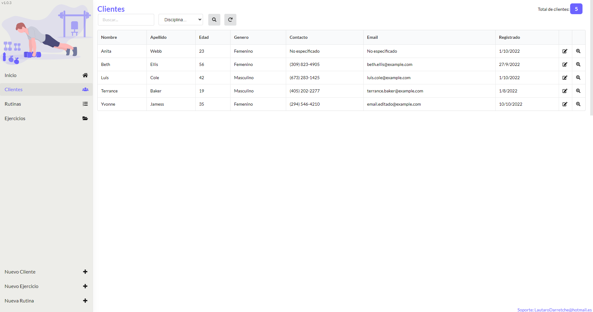
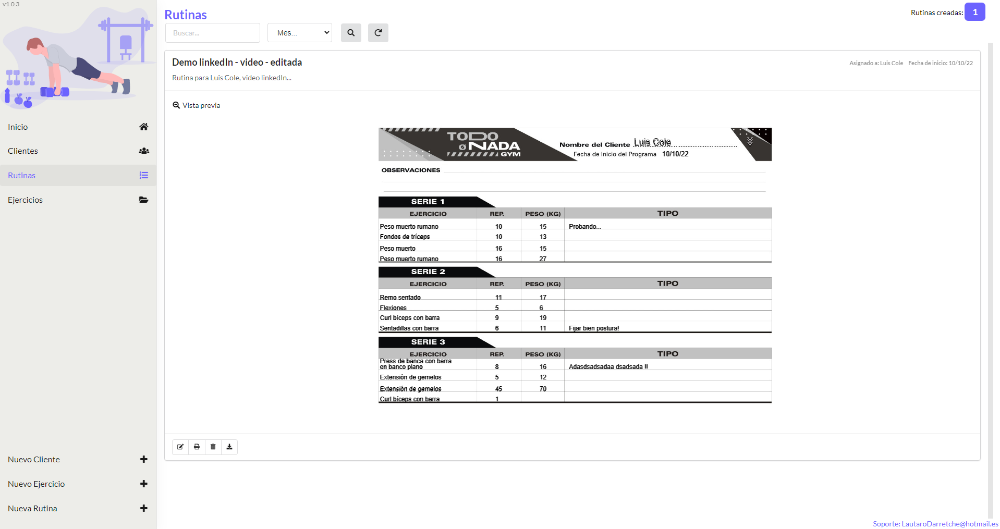
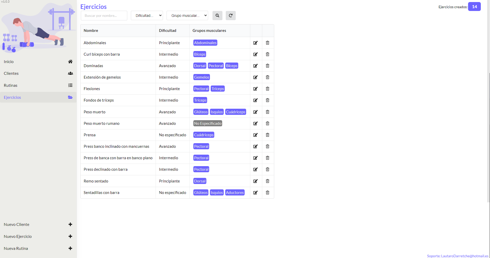
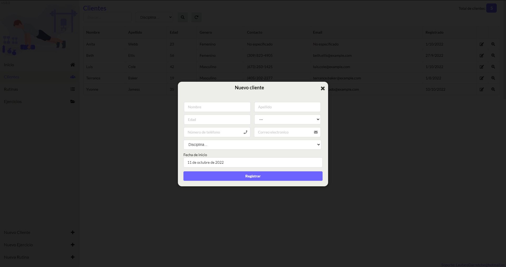
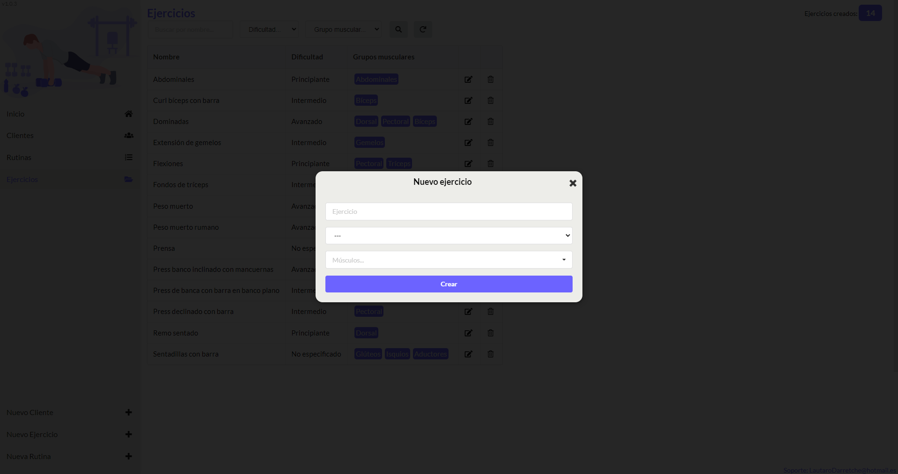
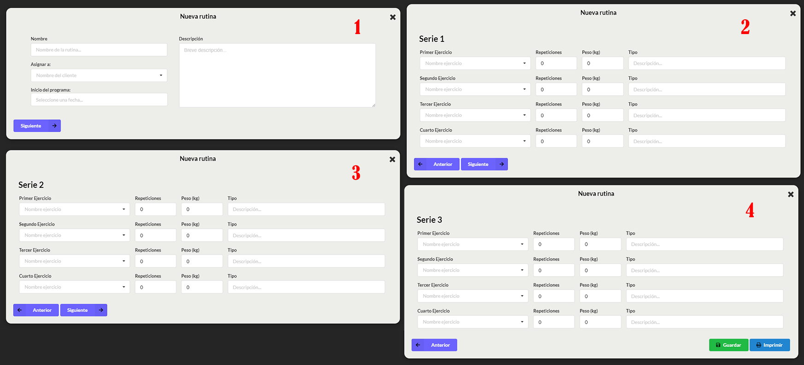
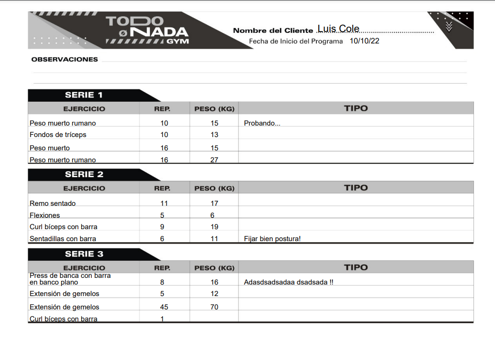

# TodoNada - Gym (Desktop App)

## Clientes:

En esta sección se puede apreciar los clientes que se tienen registrados, como también se puede editar su información y acceder al perfil de cada uno. 

## Rutinas

En esta sección se visualizan todas las rutinas creadas, donde se las puede filtrar por nombre, tanto como el de la rutina como el de la persona que la tenga asignada. También se puede visualizar solo las rutinas que hayan sido creadas en un mes en especifico. Además de también tener la opción editarlas, borrarlas, imprimirlas y/o descargarlas. También se puede acceder a la vista previa de cada una de las rutinas. 

## Ejercicios 

En esta sección se tiene una lista de todos los ejercicios agregados que posteriormente se usarán para crear un programa de entrenamiento. De esta manera el ejercicio se agrega una vez para evitar tipear cada vez que se cree una rutina nueva. Como el resto de las secciones tiene su buscador por nombre, como por dificultad del ejercicio y por grupo muscular al que pertenezca. 

## Agregar cliente:

Desde la barra de navegación lateral se puede acceder no solo a las diferentes secciones como cliente, rutinas, y ejercicios, sino que también se encuentran disponibles las opciones para agregar cliente:

## Agregar ejercicio:

## Crear rutina:

## Resultado al imprimir una rutina:

